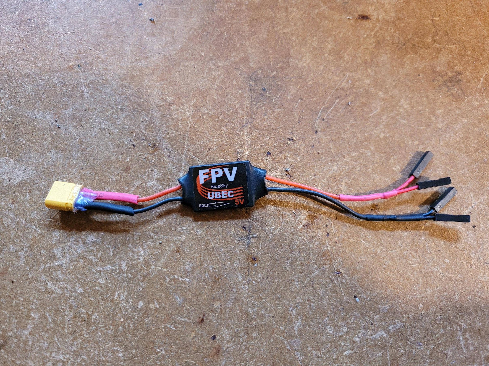
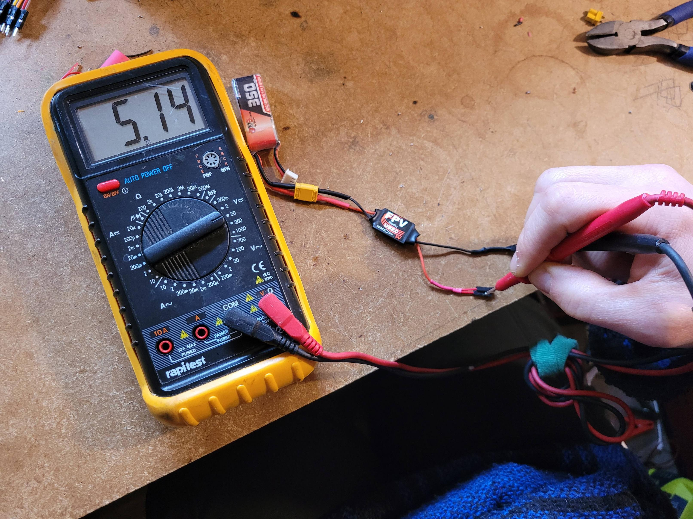
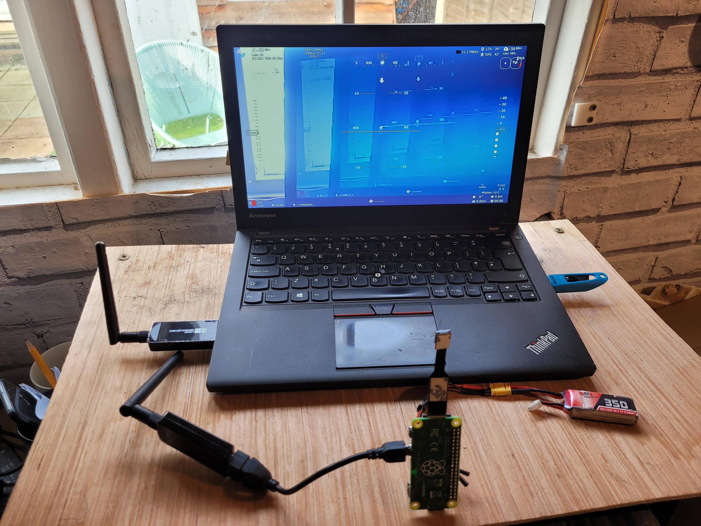

# Preparing the Air Station

## Air Station running on LiPo

Wire up a BEC (Battery Elimination Circuit). Where the BEC is rated 5V out and at least 3A. 

Usign a XT30 Male as the input and two dupont connectors, 2.54mm pitch, on each output.

<figure>
  
  <figcaption></figcaption>
</figure>

<figure>
  
  <figcaption></figcaption>
</figure>

Connect a red and black pair of the dupont connectors to [pins 4 and 6 of the PI W 2](https://www.raspberrypi.com/documentation/computers/raspberry-pi.html). Confirm powers PI W2 correcly and boots and connects to ground station. 

<figure>
  
  <figcaption></figcaption>
</figure>

## Air Station bypass USB-b Connector

